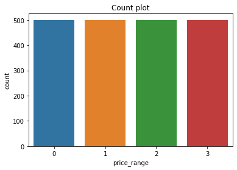
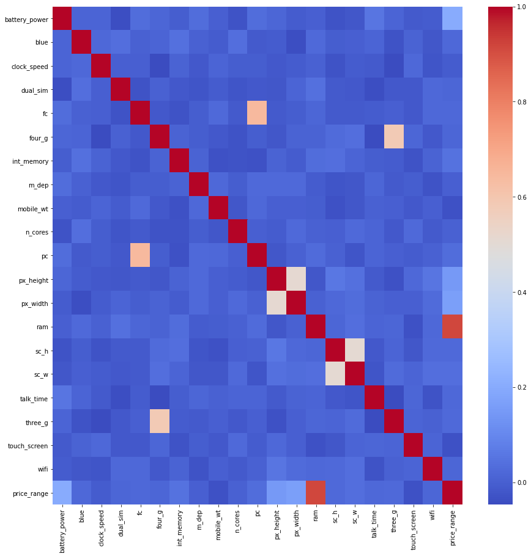
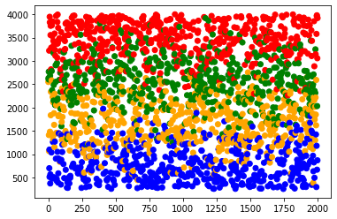
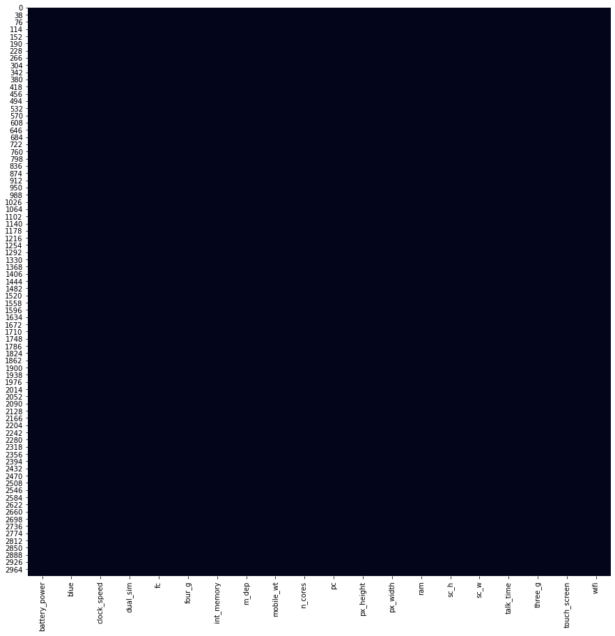
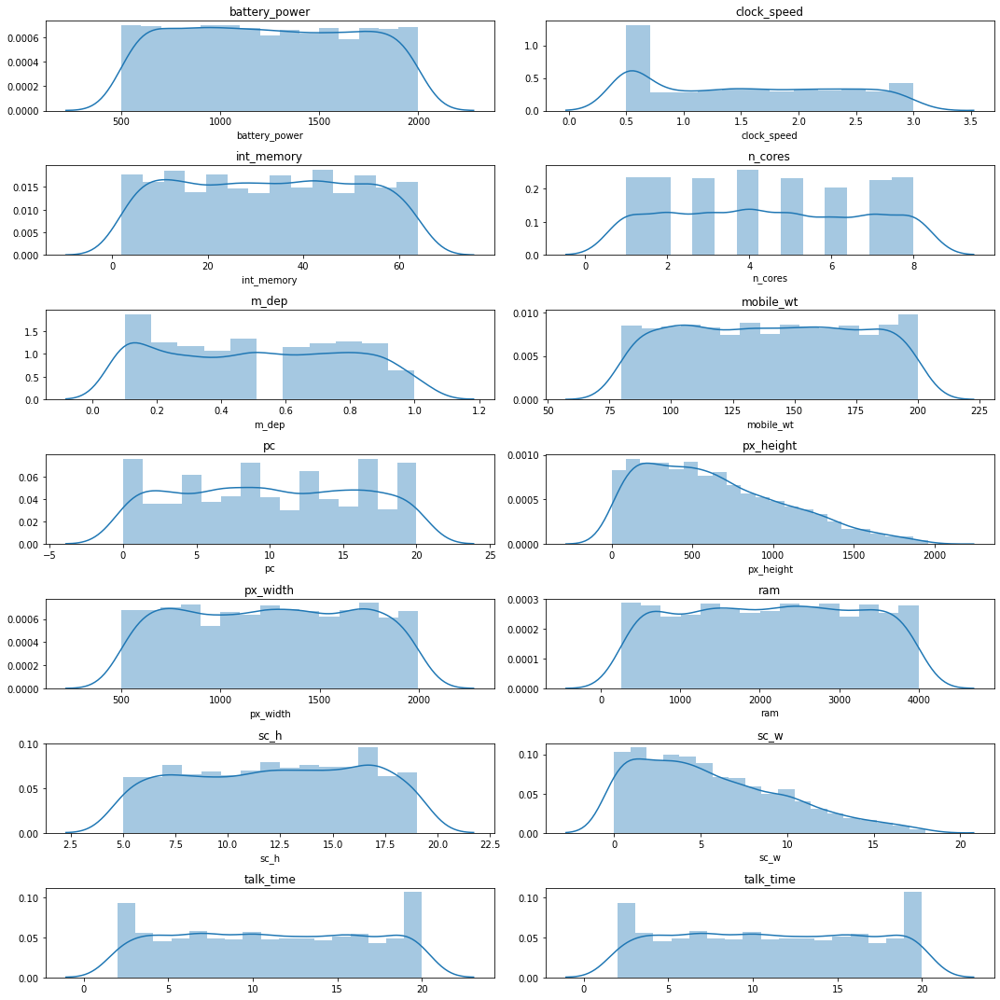
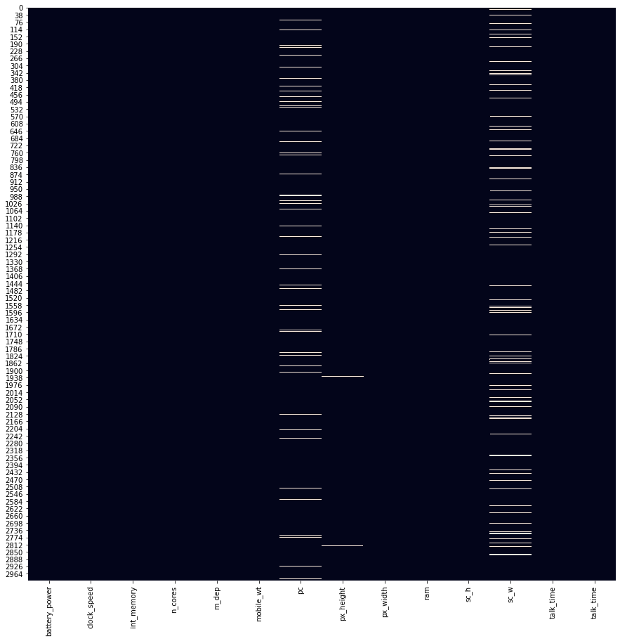
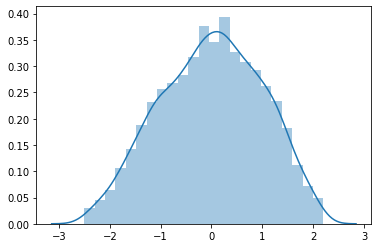

# Mobile Price Prediction

Hey all!

Imagine you are starting a new cellphone business, let's called it BCC - **Best Cellphone Company**. After years of studies and developments, you have the best product on the market! You created a product that changes the _status quo_ ! Now it is fun time: time to sell it!

**How are you going to place your innovative product in the market?** 
* Are you going to sell it for a low price to get revenue based on quantity? 
* Or are you going to start with high price imagining that the product will be  recognized, although your new company does not have a established brand?

**_SOLUTION :_** Let's use market data to find the best price for your product!

**_Key Takeaways_**
    1. Data Treatment 
    2. Dealing with Multiple Class problems : One-vs-Rest (OvR) and One-vs-One (OvO)
    3. Comparison between Logistic Regression and Support Vector Machine
    
_Source_ : [Kaggle Mobile Prediction Classification](https://www.kaggle.com/iabhishekofficial/mobile-price-classification)


```python
#Importing Libraries

import pandas as pd
import numpy as np
import seaborn as sns
import matplotlib.pyplot as plt
import matplotlib

%matplotlib inline
```


```python
#Importing dataframe

test = pd.read_csv('../data/datasets_11167_15520_test.csv')
train = pd.read_csv('../data/datasets_11167_15520_train.csv')
```

## Before we begin, 

I would like to share a mindset about working with data that may be silly, but it makes all sense for me.

> For any important event - a date, a job interview - what do you do prior to your arrival? **you prepare yourself!** You search for information on the internet, social media (Instagram, Facebook, LinkedIn), ask friends and relatives. You do it because you want to create a picture in your mind of the person's food and movie tastes, beliefs, what he/she is like... It makes easier for you to have a **match** with them.

Let me tell you that: _considering data, it is not different at all!_ You must get to know the data, bring to a dinner, have some great chat at a coffee shop, maybe see a movie together. Then, when you feel prepared, when you feel that you know everything about them, what they like or not... After all that, you can ask for a commitment and start to create a deeper connection by using _statistical learning models_ !


## Checking out dataframes, description and the goal

Here, I superficially check how the dataset is presented, the description of each attribute, and also I establish a goal for the case study.

* Total number of Attributes: 21
    * Are there discrete variables? - Yes
        * Details: blue (Bluetooth - 0 No / 1 Yes), dual_sim (0 No / 1 Yes), four_g (0 No / 1 Yes), three_g (0 No / 1 Yes), touch_screen (0 No / 1 Yes), wifi (0 No / 1 Yes)
    * Are there any continuous variables? - Yes
        * Details: battery_power,clock_speed,int_memory,n_cores*,m_dep,mobile_wt,pc,px_height,px_width,ram,sc_h,sc_w,talk_time
    *Output variable: price_range 
        * Discrete variable
        * Multiclass - 4 different classes: 0(low cost), 1(medium cost), 2(high cost) and 3(very high cost)


**_GOAL_**: Based on certain attributes, our goal is to predict the position of our new cellphone using its characteristics.


```python
# Train dataset

train.head()
```


<div>
<style scoped>
    .dataframe tbody tr th:only-of-type {
        vertical-align: middle;
    }

    .dataframe tbody tr th {
        vertical-align: top;
    }

    .dataframe thead th {
        text-align: right;
    }
</style>
<table border="1" class="dataframe">
  <thead>
    <tr style="text-align: right;">
      <th></th>
      <th>battery_power</th>
      <th>blue</th>
      <th>clock_speed</th>
      <th>dual_sim</th>
      <th>fc</th>
      <th>four_g</th>
      <th>int_memory</th>
      <th>m_dep</th>
      <th>mobile_wt</th>
      <th>n_cores</th>
      <th>...</th>
      <th>px_height</th>
      <th>px_width</th>
      <th>ram</th>
      <th>sc_h</th>
      <th>sc_w</th>
      <th>talk_time</th>
      <th>three_g</th>
      <th>touch_screen</th>
      <th>wifi</th>
      <th>price_range</th>
    </tr>
  </thead>
  <tbody>
    <tr>
      <th>0</th>
      <td>842</td>
      <td>0</td>
      <td>2.2</td>
      <td>0</td>
      <td>1</td>
      <td>0</td>
      <td>7</td>
      <td>0.6</td>
      <td>188</td>
      <td>2</td>
      <td>...</td>
      <td>20</td>
      <td>756</td>
      <td>2549</td>
      <td>9</td>
      <td>7</td>
      <td>19</td>
      <td>0</td>
      <td>0</td>
      <td>1</td>
      <td>1</td>
    </tr>
    <tr>
      <th>1</th>
      <td>1021</td>
      <td>1</td>
      <td>0.5</td>
      <td>1</td>
      <td>0</td>
      <td>1</td>
      <td>53</td>
      <td>0.7</td>
      <td>136</td>
      <td>3</td>
      <td>...</td>
      <td>905</td>
      <td>1988</td>
      <td>2631</td>
      <td>17</td>
      <td>3</td>
      <td>7</td>
      <td>1</td>
      <td>1</td>
      <td>0</td>
      <td>2</td>
    </tr>
    <tr>
      <th>2</th>
      <td>563</td>
      <td>1</td>
      <td>0.5</td>
      <td>1</td>
      <td>2</td>
      <td>1</td>
      <td>41</td>
      <td>0.9</td>
      <td>145</td>
      <td>5</td>
      <td>...</td>
      <td>1263</td>
      <td>1716</td>
      <td>2603</td>
      <td>11</td>
      <td>2</td>
      <td>9</td>
      <td>1</td>
      <td>1</td>
      <td>0</td>
      <td>2</td>
    </tr>
    <tr>
      <th>3</th>
      <td>615</td>
      <td>1</td>
      <td>2.5</td>
      <td>0</td>
      <td>0</td>
      <td>0</td>
      <td>10</td>
      <td>0.8</td>
      <td>131</td>
      <td>6</td>
      <td>...</td>
      <td>1216</td>
      <td>1786</td>
      <td>2769</td>
      <td>16</td>
      <td>8</td>
      <td>11</td>
      <td>1</td>
      <td>0</td>
      <td>0</td>
      <td>2</td>
    </tr>
    <tr>
      <th>4</th>
      <td>1821</td>
      <td>1</td>
      <td>1.2</td>
      <td>0</td>
      <td>13</td>
      <td>1</td>
      <td>44</td>
      <td>0.6</td>
      <td>141</td>
      <td>2</td>
      <td>...</td>
      <td>1208</td>
      <td>1212</td>
      <td>1411</td>
      <td>8</td>
      <td>2</td>
      <td>15</td>
      <td>1</td>
      <td>1</td>
      <td>0</td>
      <td>1</td>
    </tr>
  </tbody>
</table>
<p>5 rows × 21 columns</p>
</div>


```python
# Test dataset
    #Here, I drop the "id" column that we are not going to need it.
test.drop('id',inplace=True,axis=1)
test.head()
```


<div>
<style scoped>
    .dataframe tbody tr th:only-of-type {
        vertical-align: middle;
    }

    .dataframe tbody tr th {
        vertical-align: top;
    }

    .dataframe thead th {
        text-align: right;
    }
</style>
<table border="1" class="dataframe">
  <thead>
    <tr style="text-align: right;">
      <th></th>
      <th>battery_power</th>
      <th>blue</th>
      <th>clock_speed</th>
      <th>dual_sim</th>
      <th>fc</th>
      <th>four_g</th>
      <th>int_memory</th>
      <th>m_dep</th>
      <th>mobile_wt</th>
      <th>n_cores</th>
      <th>pc</th>
      <th>px_height</th>
      <th>px_width</th>
      <th>ram</th>
      <th>sc_h</th>
      <th>sc_w</th>
      <th>talk_time</th>
      <th>three_g</th>
      <th>touch_screen</th>
      <th>wifi</th>
    </tr>
  </thead>
  <tbody>
    <tr>
      <th>0</th>
      <td>1043</td>
      <td>1</td>
      <td>1.8</td>
      <td>1</td>
      <td>14</td>
      <td>0</td>
      <td>5</td>
      <td>0.1</td>
      <td>193</td>
      <td>3</td>
      <td>16</td>
      <td>226</td>
      <td>1412</td>
      <td>3476</td>
      <td>12</td>
      <td>7</td>
      <td>2</td>
      <td>0</td>
      <td>1</td>
      <td>0</td>
    </tr>
    <tr>
      <th>1</th>
      <td>841</td>
      <td>1</td>
      <td>0.5</td>
      <td>1</td>
      <td>4</td>
      <td>1</td>
      <td>61</td>
      <td>0.8</td>
      <td>191</td>
      <td>5</td>
      <td>12</td>
      <td>746</td>
      <td>857</td>
      <td>3895</td>
      <td>6</td>
      <td>0</td>
      <td>7</td>
      <td>1</td>
      <td>0</td>
      <td>0</td>
    </tr>
    <tr>
      <th>2</th>
      <td>1807</td>
      <td>1</td>
      <td>2.8</td>
      <td>0</td>
      <td>1</td>
      <td>0</td>
      <td>27</td>
      <td>0.9</td>
      <td>186</td>
      <td>3</td>
      <td>4</td>
      <td>1270</td>
      <td>1366</td>
      <td>2396</td>
      <td>17</td>
      <td>10</td>
      <td>10</td>
      <td>0</td>
      <td>1</td>
      <td>1</td>
    </tr>
    <tr>
      <th>3</th>
      <td>1546</td>
      <td>0</td>
      <td>0.5</td>
      <td>1</td>
      <td>18</td>
      <td>1</td>
      <td>25</td>
      <td>0.5</td>
      <td>96</td>
      <td>8</td>
      <td>20</td>
      <td>295</td>
      <td>1752</td>
      <td>3893</td>
      <td>10</td>
      <td>0</td>
      <td>7</td>
      <td>1</td>
      <td>1</td>
      <td>0</td>
    </tr>
    <tr>
      <th>4</th>
      <td>1434</td>
      <td>0</td>
      <td>1.4</td>
      <td>0</td>
      <td>11</td>
      <td>1</td>
      <td>49</td>
      <td>0.5</td>
      <td>108</td>
      <td>6</td>
      <td>18</td>
      <td>749</td>
      <td>810</td>
      <td>1773</td>
      <td>15</td>
      <td>8</td>
      <td>7</td>
      <td>1</td>
      <td>0</td>
      <td>1</td>
    </tr>
  </tbody>
</table>
</div>


## Let's dive in the output variable: price_range

Here, we start with checking **missing values**. By its name already says, missing values are data that were not entered and we cannot use them as it is. There are many ways to treat missing data and several articles that show how to deal with it:
* Filling it up with the arithmetic, harmonic mean
* Filling it up with the mode and median
* Or just ignoring and deleting them.
    
**_Luckily, there are no missing values!!_**


```python
#Let's dive in the output variable
y_train = train.price_range.values

#Count plot
sns.countplot(x='price_range',data=train)
plt.title('Count plot')
#Equal number of values for each class - Great!

#Check missing values
miss = (1-train.price_range.isnull().value_counts()/train.price_range.count())*100
'There is {}% of missing values in the output variable'.format(miss[0])
```


    'There is 0.0% of missing values in the output variable'





## We can see as well that the classes are evenly distributed as well!

It is great for us! Let me show you the reason...

> Suppose the price range is distributed as 90% class 0, 10% class 1 and 0% class 2 and 3. If we built a model that the output is class 0 regardless of the input, we would be right 90% of cases!

## Now that we already searched for the output, let's ask its relatives and friends...

I used a great tool to show the **CORRELATION** between the attributes and output.

A high correlation between the output and attribute is great because based on the attribute, you can certainly predict the output. 

However, a high correlation among attributes is bad, because it reduces the success of your model. Therefore, it may be useful to filter some of the attributes.
> It is the same when you have to do a group homework when 2 classmates have strong opinions. They both want to do well on the homework and get an A (prediction), but they spend too much time discussing it (same information).

#### IMPORTANT :
The heatmap tool only considers the correlation between **two variables** or, in other words, 2 dimensional. In fact, the correlation may occur in a multi-dimensional space. Even if in a 2-dimensional space there is a low correlation index, if it is added the third attribute, it may show correlation and decrease the effectiveness of the model!

There are different ways to check and deal with correlation among attributes:
* Variance Inflation Factor (VIF)
* PCA
* Dealing with correlation analyzing 2 by 2 attributes
* Among others


```python
#Let's check the correlation between variables and output
corr = train.corr()
plt.figure(figsize=(15,15))
sns.heatmap(corr,cmap='coolwarm')
```


    <matplotlib.axes._subplots.AxesSubplot at 0x7f3d87089e90>





1. There are minor correlations between pc/fc and three_g/four_g. However, we are not going to delete any variable. 
    We will keep an eye on these pairs.
2. The variable ram has a big role in the price prediction

Based on the previous heatmap, we may see a high correlation between the output and the feature ram. Let's investigate it a litte bit more...


```python
ram = train.ram.values
lbl = train.price_range.values
colors = ['blue','orange','green','red']
plt.scatter(train.index,ram,c=lbl, cmap=matplotlib.colors.ListedColormap(colors))
```


    <matplotlib.collections.PathCollection at 0x7f3d87093510>





### For now, let's focus on the attributes. They may have more to say when the output it is not around...


```python
#Missing values train and test set
train_id = train.index.values.shape[0]
test_id = test.index.values.shape[0]
train.drop('price_range',inplace=True,axis=1)

#Train and test data set combined
df = pd.concat([train,test],ignore_index=True)

#Check Missing values
plt.figure(figsize=(15,15))
sns.heatmap(df.isnull(),cbar=False)

## No missing values! Great!
```


    <matplotlib.axes._subplots.AxesSubplot at 0x7f3d86ad9910>





### Continuous variables - Checking the distribution of each variable

The distribution of continuous features has a big role in the performance of the solution of any machine learning problem. The most famous statistical distribution is Normal/Gaussian distribution. Most of all statistical learning models are based on the assumption of normality of data and, in some cases, they may accept deviations from normality.

When working with data, it is important to check the distribution of continuous variables and transform them into Gaussian distribution when possible.


```python
cont = ['battery_power','clock_speed','int_memory','n_cores','m_dep','mobile_wt','pc','px_height','px_width','ram','sc_h','sc_w','talk_time','talk_time']
df_cont = df[cont]

#Distribution plot
row = 7
col = 2
k=0
fig,axes=plt.subplots(row,col,figsize=(15, 15))
for i in range(row):
    for j in range(col):
        value = cont[k]
        sns.distplot(df_cont[value],ax=axes[i][j])
        axes[i][j].set_title(value)
        k=k+1
plt.tight_layout()

```





```python
#Checking the distribution of each variable
from scipy.stats import kurtosis, skew

#Quick stats
kurt = kurtosis(df_cont)
skewness = skew(df_cont)

stats = pd.DataFrame([kurt,skewness],columns = cont, index = ['Kurtosis','Skewness'])
stats
```


<div>
<style scoped>
    .dataframe tbody tr th:only-of-type {
        vertical-align: middle;
    }

    .dataframe tbody tr th {
        vertical-align: top;
    }

    .dataframe thead th {
        text-align: right;
    }
</style>
<table border="1" class="dataframe">
  <thead>
    <tr style="text-align: right;">
      <th></th>
      <th>battery_power</th>
      <th>clock_speed</th>
      <th>int_memory</th>
      <th>n_cores</th>
      <th>m_dep</th>
      <th>mobile_wt</th>
      <th>pc</th>
      <th>px_height</th>
      <th>px_width</th>
      <th>ram</th>
      <th>sc_h</th>
      <th>sc_w</th>
      <th>talk_time</th>
      <th>talk_time</th>
    </tr>
  </thead>
  <tbody>
    <tr>
      <th>Kurtosis</th>
      <td>-1.206485</td>
      <td>-1.327820</td>
      <td>-1.202377</td>
      <td>-1.221338</td>
      <td>-1.254421</td>
      <td>-1.205739</td>
      <td>-1.194834</td>
      <td>-0.321233</td>
      <td>-1.208986</td>
      <td>-1.191294</td>
      <td>-1.192876</td>
      <td>-0.298492</td>
      <td>-1.207900</td>
      <td>-1.207900</td>
    </tr>
    <tr>
      <th>Skewness</th>
      <td>0.033587</td>
      <td>0.181071</td>
      <td>0.014648</td>
      <td>0.043070</td>
      <td>0.063355</td>
      <td>0.007305</td>
      <td>0.012974</td>
      <td>0.648747</td>
      <td>-0.001558</td>
      <td>-0.011675</td>
      <td>-0.079958</td>
      <td>0.680002</td>
      <td>0.011672</td>
      <td>0.011672</td>
    </tr>
  </tbody>
</table>
</div>


Three important parameters to check for normality are the **graph, kurtosis and skewness** . Here, we can see that no feature presented a normal distribution.


```python
#Are there negative values?? Or zero values?
plt.figure(figsize=(15,15))
sns.heatmap(df_cont<=0,cbar=False)

#There are too many values equal to zero, therefore Box Cox transformation may not be valuable...
#I could not find a better way to transform flat distributions to normal distribution... Let's focus 'px_height', which is right skewed.
```


    <matplotlib.axes._subplots.AxesSubplot at 0x7f3d83e62bd0>





There are several ways to transform the data into normal distribution. However, I failed to find a good way to transform the features that presented a flat distribution.

Therefore, I focused on the "px_height" feature, which presented a right skewed distribution. Also, I realized that **Box-Cox** transformation does not work well with zero values in the dataset. Then, I used **yeo-johnson** transformation.


```python
#Transformation - px_height
from sklearn.preprocessing import PowerTransformer
transf =df_cont['px_height'].to_numpy()
lambd = [-2,-1,-0.5,0,1,0.5,1,2]
#for i in lambd:
tr = PowerTransformer(method='yeo-johnson',standardize = True).fit_transform(transf.reshape(-1,1))
sns.distplot(tr)


kurt = kurtosis(tr)
skewness = skew(tr)
print('Kurtosis is {} and Skewness is {}'.format(kurt,skewness))

#The stats are still not good, but let's try it. I have tried the log (1+x) but it does not work good as well (Skewed)
```

    Kurtosis is [-0.66141044] and Skewness is [-0.12665389]





```python
#Updating the new Transformation
df['px_height'] = tr

#Let's settle the train and test dataset
train_set = df.values[:train_id]
test_set = df.values[train_id:]
```

## Multiple classification problem

* We are going to perform two machine learning techiniques: **SVM** and **Logistic Regression**. 

_**Plus, we are going to try using only the variable "ram"**_.


```python
#Importing libraries
from sklearn.preprocessing import RobustScaler,StandardScaler
import xgboost as xgb
from sklearn.model_selection import cross_val_score, train_test_split, StratifiedKFold
from sklearn.svm import SVC
from sklearn.multiclass import OneVsRestClassifier,OneVsOneClassifier
from sklearn.linear_model import LogisticRegression
```

The two selected models are designed to deal with binary classification problems. However, there are several approaches that manage this situation. 

They are: **One-vs-Rest (OvR)** and **One-vs-One (OvO)**. 

It is not my goal here to explain about these methods, but basically they categorize each class by comparing each one of them and each other (one vs one) or other attributes together (one vs rest).

#### Metrics

Based on a classification problem, there are many metrics to measure the success of the model.

>Here, we are going to use the _**AUC-ROC**_ .

#### Define a cross validation strategy
We use the cross_val_score function of Sklearn. However this function has not a shuffle attribut, we add then one line of code, in order to shuffle the dataset prior to cross-validation


```python
#Validation function
n_folds = 10

def auc_cv(model):
    kf = StratifiedKFold(n_folds, shuffle=True, random_state=100).get_n_splits(train)
    auc= cross_val_score(model, train, y_train, scoring="roc_auc_ovr", cv = kf,n_jobs=-1)
    return(np.mean(auc))
```

OBS.: I am using One-vs-Rest.

# Training

### Support Vector Machine


```python
#Implementing SVC
###Multi class problem

#Train data
train = train_set

#Model
svc = SVC(C=1,kernel='rbf',random_state=43,probability=True)

#Score
score = auc_cv(svc)
print('SVC score = {} based on AUC-ROC'.format(score))
```

    SVC score = 0.9888866666666667 based on AUC-ROC


As we can see, SVM performed pretty well when compared to Logistic Regression. The data presents a non-linear distribution and it is hard for the logistic regression model to perform well. Therefore, based on hyperplanes, SVM achieved a greater metric.

### Logistic Regression


```python
#Implementing Logistic Regression

#Train data
#train = ram.reshape(-1,1)
train=train_set

#Model
lreg1 = LogisticRegression(penalty='l2',C=1,class_weight='balanced',random_state=54,multi_class='ovr')

#Score
score = auc_cv(lreg1)
print('Logistic Regression score = {} based on AUC-ROC'.format(score))
```

    Logistic Regression score = 0.8751033333333332 based on AUC-ROC


### Logistic Regression with regularization


```python
#Implementing Logistic Regression
from sklearn.linear_model import LogisticRegression

#Train data
train=train_set

#Model
lreg2 = LogisticRegression(penalty='l2',C=0.1,class_weight='balanced',random_state=54,multi_class='ovr')

#Score
score = auc_cv(lreg2)
print('Logistic Regression score = {} based on AUC-ROC'.format(score))
```

    Logistic Regression score = 0.8761966666666667 based on AUC-ROC


### Logistic Regression - Feature Engineering


```python
#Implementing Logistic Regression - ONLY WITH RAM
from sklearn.linear_model import LogisticRegression

#Train data
train = ram.reshape(-1,1)

#Model
lreg3 = LogisticRegression(penalty='l2',C=1,class_weight='balanced',random_state=54,multi_class='ovr')

#Score
score = auc_cv(lreg3)
print('Logistic Regression score = {} based on AUC-ROC'.format(score))
```

    Logistic Regression score = 0.90611 based on AUC-ROC


Here, I implemented logistic regression in three different ways to see the importance of **regularization** and **feature engineering**.

Regularization is important to reduce the overfitting of your model. Here, it presented a slight improvement in the performance.

However, the greatest improvement was with feature engineering. Feature Engineering is the selection of key features to use in the model instead of using all of them. If all input variables are used, the model may perform poorly since the effects and information of each of them are mixed with each other. Therefore, using only the feature "ram", we can see an increase in the AUC-ROC metric, which means a greater performance!
